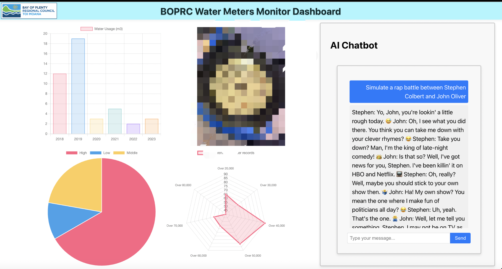

BOPRC has a large amount of water meter data, much of which is manually entered into Excel by employees who first take pictures with their cell phones and then manually enter all the collected data into Excel.
This process would save BOPRC a lot of labor costs if they could use AI, perform image recognition, and then add automated office work.

This website demo is a vision of integrating GPT in the front-end webpage and employees uploading images to Chat Bot on the right side while data recognition is performed.
When the text message is recognized, the employee chooses to enter the information into the backend database.
Also on the left side of the webpage is the ability to visualize the books in the database.

## The following is the demo of the website



## I upload a new ipynb file, which is the code for the next step of this project:

### RAG is an artificial intelligence framework for retrieving from externally set databases and using them in inference. Make large language models based on the most accurate and up-to-date information. In my vision, using RAG to use water meter data as a database allows the user to look up data for a specific date or location at any time and use it for comparison and inspection.

### Because of government needs, our LLM needs to be deployed locally, here is an instructional post I found on the langchain website:

https://python.langchain.com/docs/use_cases/question_answering/local_retrieval_qa

### Because I am using the Apple M1 chip on TensorFlow support is not comprehensive, can not use huggingface provided embeddings tool, so in the debug process spent a lot of time, if you are also using the Arm architecture chip, please note that the LlamaCppEmbeddings also have support problems, you need to langchain chromadb and huggingface-hub as well as onnx are updated to the latest version, the old version of the old version will be encountered:

```ssh
ValueError: Expected EmbeddingFunction.__call__ to have the following signature: odict_keys(['self', 'input']), got odict_keys(['self', 'args', 'kwargs'])
```

## The demo out put:


